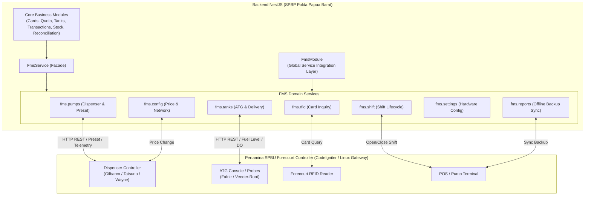

# Analisis Integrasi FMS Module & Services
## Sistem Monitoring BBM (SPBP Polda Papua Barat) × Pertamina Forecourt Controller & POS API

Dokumen ini berisi analisis komprehensif mengenai kemungkinan, skenario, dan blueprint implementasi integrasi antara **Core Backend Fuel Monitoring System (NestJS)** dengan **FmsModule & Services** yang telah terhubung ke **Pertamina SPBU Forecourt Controller & POS Gateway**.

---

## 1. Executive Summary & Arsitektur Integrasi

### Kondisi Saat Ini (As-Is):
- Sistem backend mengelola data kartu RFID, kuota satker/kendaraan, alokasi bulanan, stok tangki pendam, dan rekonsiliasi.
- Mayoritas input data bergantung pada pencatatan manual operator atau endpoint push satu arah (`/api/controller/transaction`).
- Belum ada komunikasi dua arah (bi-directional) secara real-time ke hardware dispenser (Gilbarco/Wayne), Automatic Tank Gauge (ATG/Fafnir), maupun sistem shift controller.

### Kondisi Setelah Integrasi (To-Be):
Dengan tersedianya [`FmsService`](file:///f:/project/pertamina/Dashboar%20Monitoring%20Fuel/backend/src/modules/fms/fms.service.ts) dan 11 sub-service domain di backend, sistem dapat melakukan **Closed-Loop Automation**:
1. **Otorisasi Dispenser Otomatis (Pre-Auth / Preset)** berbasis sisa kuota kartu RFID aktif.
2. **Monitoring Real-Time Telemetri ATG & Pompa** tanpa menunggu input manual operator.
3. **Penerimaan BBM Digital (Receiving DO)** dengan snapshot level tangki otomatis.
4. **Rekonsiliasi 3 Arah Otomatis** (Data Transaksi Sistem vs Totalizer Pompa vs Fisik Tangki ATG).
5. **Sinkronisasi Otomatis Shift & Harga BBM** langsung ke controller forecourt.

---

## 2. Diagram Alur Integrasi (High-Level Architecture)



---

## 3. Matriks Kemungkinan Integrasi per Modul

| Modul Backend Existing | Sub-Service FMS Terkait | Skenario & Peluang Integrasi | Manfaat Operasional |
|---|---|---|---|
| **`TanksModule`** | `fms.tanks` | **1. Telemetri Real-Time ATG**<br>Polling berkala data sensor ATG (tinggi minyak, tinggi air, volume, suhu) ke tabel `tank_readings` dan update `tanks.current_l`. | Menghilangkan dipping manual tangki; deteksi kebocoran dan intrusi air secara instan. |
| **`StockModule`** | `fms.tanks` | **2. Penerimaan BBM Otomatis (DO Receiving)**<br>Integrasi start/stop delivery dengan snapshot volume awal-akhir tangki, mencatat No DO, No Invoice, dan Nopol truk tangki. | Validasi akurasi volume pengiriman dari mobil tangki Pertamina Patra Niaga secara presisi. |
| **`CardsModule` & `QuotaModule`** | `fms.rfid`, `fms.pumps` | **3. Validasi Kartu & Pre-Authorization (Preset)**<br>Cek saldo/kuota kartu aktif saat RFID di-scan, lalu kirim limit preset (volume/rupiah) ke dispenser sebelum nozzle diangkat. | Menghindari pengisian melebihi kuota bulanan satker (*zero quota overflow*). |
| **`TransactionsModule`** | `fms.pumps`, `fms.reports` | **4. Finalisasi Transaksi Otomatis**<br>Polling status transaksi preset hingga selesai (`IsCompleted = true`), lalu otomatis catat transaksi ke DB & potong `CardQuota`. | Menghilangkan risiko operator salah catat volume atau manipulasi struk. |
| **`PumpsModule`** | `fms.pumps` | **5. Sync Totalizer Elektronik & Lock/Unlock**<br>Membaca totalizer nozzle real-time; fitur Lock dispenser jika kuota darurat habis atau terjadi pelanggaran SOP. | Keamanan forecourt maksimal dan pencegahan penyaluran ilegal. |
| **`ReconciliationModule`** | `fms.pumps`, `fms.tanks`, `fms.reports` | **6. Rekonsiliasi 3 Arah Otomatis**<br>Membandingkan otomatis selisih ATG, totalizer dispenser, dan riwayat transaksi sistem setiap hari/shift. | Audit trail anti-fraud otomatis tanpa perlu kalkulasi spreadsheet manual. |
| **`MasterModule`** | `fms.config`, `fms.settings` | **7. Push Jadwal Perubahan Harga BBM**<br>Saat admin update harga di master data, sistem otomatis menjadwalkan update harga ke controller (`schedulePriceChange`). | Dispenser otomatis menerapkan harga baru pada tanggal & jam efektif. |
| **`AuthModule` & `SystemModule`** | `fms.shift`, `fms.auth`, `fms.users` | **8. Sinkronisasi Shift Kerja & Petugas**<br>Buka/Tutup shift sistem SPBP terhubung langsung dengan `openShift`/`closeShift` di forecourt controller. | Pembagian tanggung jawab totalizer per operator yang presisi. |
| **`HealthModule`** | `fms.discovery`, `fms.client` | **9. Forecourt Hardware Diagnostic & Heartbeat**<br>Monitoring kesehatan koneksi controller (`ping`, `acknowledge`, `getListDevices`, `getListUsb`). | Early warning jika kabel serial USB ke dispenser/ATG terputus. |
| **`ReportsModule`** | `fms.reports` | **10. Pemulihan Transaksi Offline (Buffer Replay)**<br>Tarik data transaksi offline dari controller saat koneksi sempat putus melalui `fms.reports.syncBackup`. | Tidak ada data transaksi yang hilang saat jaringan internet/LAN down. |

---

## 4. Blueprint Implementasi & Contoh Integrasi Nyata

Berikut adalah blueprint kode konkret yang siap digunakan untuk menghubungkan modul-modul existing dengan `FmsService`:

### Blueprint 1: Real-Time ATG Telemetry Ingestion (Tangki & Sensor)
Menghubungkan `TanksService` dengan pembacaan sensor Fafnir ATG otomatis setiap interval waktu tertentu (misal tiap 5 menit atau on-demand):

```typescript
import { Injectable, Logger } from '@nestjs/common';
import { Cron, CronExpression } from '@nestjs/schedule';
import { TanksService } from '../tanks/tanks.service';
import { FmsService } from '../fms';

@Injectable()
export class TankAtgSyncService {
  private readonly logger = new Logger(TankAtgSyncService.name);

  constructor(
    private readonly tanksService: TanksService,
    private readonly fms: FmsService,
  ) {}

  // Sync berkala setiap 5 menit
  @Cron(CronExpression.EVERY_5_MINUTES)
  async syncAllTanksTelemetry() {
    const tanks = await this.tanksService.findAll();

    for (const tank of tanks) {
      try {
        // Ambil data real-time ATG dari controller
        const atgData = await this.fms.tanks.getLastTankData({
          TankNumber: 1, // Mapping nomor tangki
        });

        if (atgData && atgData.Volume !== undefined) {
          // Masukkan pembacaan sensor ke DB via TanksService existing
          await this.tanksService.addReading(tank.id, {
            volume_l: Number(atgData.Volume),
            height_cm: Number(atgData.FuelHeightCm ?? 0),
            water_level: Number(atgData.WaterHeightCm ?? 0),
            temperature: Number(atgData.TemperatureC ?? 28.0),
            source: 'SENSOR',
            read_at: new Date().toISOString(),
          });

          this.logger.log(`Sync ATG Tangki ${tank.id} berhasil: ${atgData.Volume} L`);
        }
      } catch (err: any) {
        this.logger.warn(`Gagal sync ATG Tangki ${tank.id}: ${err.message}`);
      }
    }
  }
}
```

---

### Blueprint 2: Smart Pre-Authorization Dispenser Berbasis Kuota RFID
Skenario saat kendaraan dinas men-tap kartu RFID di dispenser atau operator memilih kartu pada web POS:

```typescript
import { Injectable, BadRequestException } from '@nestjs/common';
import { InjectRepository } from '@nestjs/typeorm';
import { Repository } from 'typeorm';
import { Card, CardQuota } from '../../database/entities';
import { FmsService } from '../fms';
import { toNum } from '../../common/utils/db.util';

@Injectable()
export class DispenserPreAuthService {
  constructor(
    @InjectRepository(Card)
    private readonly cardRepo: Repository<Card>,
    @InjectRepository(CardQuota)
    private readonly quotaRepo: Repository<CardQuota>,
    private readonly fms: FmsService,
  ) {}

  async authorizeFueling(params: {
    cardNumber: string;
    pumpNo: number;
    hoseNo: number;
    requestedAmount?: number;
  }) {
    // 1. Validasi status kartu
    const card = await this.cardRepo.findOne({
      where: { cardNumber: params.cardNumber },
      relations: ['vehicle', 'unit'],
    });

    if (!card || card.status !== 'ACTIVE') {
      throw new BadRequestException('Kartu tidak valid atau diblokir');
    }

    // 2. Cek ketersediaan pompa & nozzle di forecourt controller
    const check = await this.fms.pumps.checkPreset({
      PumpNo: params.pumpNo,
      HoseNo: params.hoseNo,
    });

    // 3. Ambil sisa kuota aktif
    const quota = await this.quotaRepo
      .createQueryBuilder('cq')
      .innerJoin('cq.period', 'qp')
      .where('cq.cardId = :cardId AND qp.status = :status', {
        cardId: card.id,
        status: 'ACTIVE',
      })
      .getOne();

    const remainingQuotaL = toNum(quota?.remainingL, 0);
    if (remainingQuotaL <= 0) {
      throw new BadRequestException('Sisa kuota BBM kartu ini telah habis');
    }

    // 4. Hitung limit rupiah/liter untuk dispenser
    const authorizedAmount = params.requestedAmount
      ? Math.min(params.requestedAmount, remainingQuotaL * 10000)
      : remainingQuotaL * 10000;

    // 5. Kirim perintah preset ke dispenser hardware
    const presetRes = await this.fms.pumps.createPreset({
      PumpNo: params.pumpNo,
      HoseNo: params.hoseNo,
      Amount: authorizedAmount,
      VehicleNo: card.vehicle?.policeNumber ?? '',
      VehicleType: card.vehicle?.brand ?? '',
      AgencyName: card.unit?.name ?? 'Polda Papua Barat',
      Card: {
        CardNo: card.cardNumber,
        PlateNo: card.vehicle?.policeNumber,
        CustomerName: card.holderName,
        Balance: remainingQuotaL,
      },
    });

    return {
      success: true,
      presetId: presetRes.PresetId,
      authorizedAmount,
      remainingQuotaL,
      message: `Dispenser ${params.pumpNo} berhasil di-otorisasi`,
    };
  }
}
```

---

### Blueprint 3: Alur Penerimaan BBM Digital (Receiving DO Tangki)
Integrasi modul `StockModule` dengan proses penerimaan BBM dari mobil tangki Pertamina Patra Niaga:

```typescript
import { Injectable } from '@nestjs/common';
import { FmsService } from '../fms';

@Injectable()
export class DeliveryAutomationService {
  constructor(private readonly fms: FmsService) {}

  // 1. Mulai pengisian BBM ke tangki pendam
  async startReceiving(tankNumber: number) {
    const res = await this.fms.tanks.startDelivery({ TankNumber: tankNumber });
    return {
      success: true,
      initialLevel: res.StartVolumeL,
      message: `Penerimaan BBM Tangki ${tankNumber} dimulai`,
    };
  }

  // 2. Selesai pengisian BBM & rekam DO resmi
  async finishReceiving(data: {
    tankNumber: number;
    noDO: string;
    noInvoice: string;
    deliveryVolume: number;
    noKendaraan: string;
    namaPengemudi: string;
    pengirim: string;
  }) {
    const stopRes = await this.fms.tanks.stopDelivery({
      TankNumber: data.tankNumber,
      NoDO: data.noDO,
      NoInvoice: data.noInvoice,
      DeliveryVolume: data.deliveryVolume,
      NoKendaraan: data.noKendaraan,
      NamaPengemudi: data.namaPengemudi,
      Pengirim: data.pengirim,
    });

    return {
      success: true,
      startVolume: stopRes.StartVolumeL,
      endVolume: stopRes.EndVolumeL,
      receivedVolume: stopRes.ReceivedVolumeL,
      message: 'Penerimaan BBM selesai dan data DO berhasil diverifikasi ATG',
    };
  }
}
```

---

### Blueprint 4: Otomasi Rekonsiliasi 3 Arah (Reconciliation Engine)
Memadukan `ReconciliationService` dengan data fisik totalizer dan ATG dari FMS:

```typescript
import { Injectable } from '@nestjs/common';
import { ReconciliationService } from '../reconciliation/reconciliation.service';
import { FmsService } from '../fms';

@Injectable()
export class AutomatedReconciliationEngine {
  constructor(
    private readonly reconcileService: ReconciliationService,
    private readonly fms: FmsService,
  ) {}

  async executeDailyReconciliation(date: string) {
    // 1. Ambil data totalizer terkini dari dispenser
    const pumpData = await this.fms.pumps.listPumps();

    // 2. Ambil data fisik level tangki dari ATG
    const tankData = await this.fms.tanks.listTanks();

    // 3. Jalankan rekonsiliasi matematis sistem
    const results = await this.reconcileService.runReconciliation(date, 'SYSTEM_AUTO_RECON');

    return {
      date,
      reconciliationResults: results,
      forecourtPumpsCount: pumpData.Pumps?.length ?? 0,
      forecourtTanksCount: tankData.Tanks?.length ?? 0,
    };
  }
}
```

---

### Blueprint 5: Push Perubahan Harga BBM Otomatis
Integrasi saat admin mengubah harga di `MasterModule` / Price History:

```typescript
import { Injectable } from '@nestjs/common';
import { FmsService } from '../fms';

@Injectable()
export class PriceBroadcastService {
  constructor(private readonly fms: FmsService) {}

  async broadcastPriceUpdate(productId: number, newPrice: number, effectiveDate: Date) {
    const activeDT = effectiveDate.toISOString().replace('T', ' ').substring(0, 19);

    const response = await this.fms.config.schedulePriceChange({
      GradeId: productId,
      Price: newPrice,
      ActiveDT: activeDT,
    });

    return {
      success: true,
      gradeId: productId,
      price: newPrice,
      activeDT,
      response,
    };
  }
}
```

---

## 5. Rencana Tahapan Implementasi (Roadmap)

```
┌─────────────────────────────────────────────────────────────────────────────┐
│ TAHAP 1: READ-ONLY & MONITORING (Low Risk - Quick Win)                     │
│ - Sinkronisasi berkala data ATG Tangki ke database (Tank Readings).         │
│ - Monitoring status live dispenser pompa (Idle, Nozzle Up, Fueling).        │
│ - Health check & heartbeat koneksi hardware forecourt.                     │
├─────────────────────────────────────────────────────────────────────────────┤
│ TAHAP 2: OPERATION WORKFLOWS (Medium Risk)                                  │
│ - Digitalisasi Penerimaan BBM (DO Delivery Start/Stop & Snapshot ATG).       │
│ - Sinkronisasi Buka/Tutup Shift Operator SPBP ke Forecourt Controller.      │
│ - Auto-push perubahan harga BBM ke Dispenser Controller.                    │
├─────────────────────────────────────────────────────────────────────────────┤
│ TAHAP 3: CLOSED-LOOP PRESET & PRE-AUTHORIZATION (Full Automation)           │
│ - Otorisasi Dispenser berbasis sisa kuota kartu RFID (Smart Preset).         │
│ - Auto-Finalisasi transaksi dispenser & pemotongan kuota seketika.          │
│ - Emergency remote lock/unlock dispenser pompa.                             │
└─────────────────────────────────────────────────────────────────────────────┘
```

---

## 6. Konfigurasi Dinamis FMS via Database (System Settings)

Sistem mendukung konfigurasi parameter koneksi FMS langsung dari tabel database `system_settings` tanpa perlu restart server atau mengubah file `.env`:

### Parameter Kunci di Database:
| Key `system_settings` | Tipe Data | Deskripsi | Default / Fallback |
|---|---|---|---|
| `fms_base_url` | String | Target Base URL Controller API (e.g. `http://192.168.1.100/api`) | `process.env.FMS_BASE_URL` atau `http://localhost/api` |
| `fms_timeout_ms` | Number (String) | Request timeout dalam milidetik (e.g. `15000`) | `process.env.FMS_TIMEOUT_MS` atau `15000` |
| `fms_debug` | Boolean (`true`/`false`) | Mengaktifkan log request & response Axios FMS | `NODE_ENV === 'development'` |
| `fms_enabled` | Boolean (`true`/`false`) | Flag sakelar untuk mengaktifkan / menonaktifkan integrasi FMS | `true` |
| `fms_headers` | JSON String | Custom header tambahan (e.g. `{"X-SPBU-ID": "31.123.45"}`) | Default headers |

### Contoh Penggunaan Method Konfigurasi:
```typescript
// 1. Mengambil konfigurasi aktif (tersinkron otomatis DB + fallback env)
const config = await fms.getConfig();
console.log(config.baseUrl, config.timeoutMs, config.source);

// 2. Mengubah konfigurasi FMS langsung ke Database
await fms.saveConfig({
  baseUrl: 'http://192.168.1.100/api',
  timeoutMs: 20000,
  debug: false,
  enabled: true,
}, 'usr-admin01');

// 3. Test koneksi & latency ke Forecourt Controller
const testResult = await fms.testConnection({
  baseUrl: 'http://192.168.1.100/api',
  timeoutMs: 5000,
});
console.log(testResult.success, testResult.latencyMs, testResult.controllerVersion);
```

---

## 7. Aspek Keamanan, Resiliensi & Failover

1. **Jaringan & Failover Controller**:
   - Jika koneksi HTTP ke controller forecourt terputus, backend akan mencatat log peringatan tanpa membuat backend crash berkat error handling terisolasi di [`FmsClientService`](file:///f:/project/pertamina/Dashboar%20Monitoring%20Fuel/backend/src/modules/fms/client/fms-client.service.ts).
2. **Buffer Replay Pasca Pemulihan Jaringan**:
   - Manfaatkan `fms.reports.syncBackup()` untuk menarik transaksi offline yang terjadi selama jeda jaringan.
3. **In-Memory Cache dengan Auto-Refresh**:
   - Query konfigurasi database di-cache selama 15 detik untuk performa tinggi, dan otomatis di-refresh seketika saat `saveConfig()` dipanggil.

---

## 8. Kesimpulan

Modul [`FmsModule`](file:///f:/project/pertamina/Dashboar%20Monitoring%20Fuel/backend/src/modules/fms/fms.module.ts) yang telah dibangun menyediakan fondasi lengkap untuk menghubungkan seluruh modul operasional SPBP Polda Papua Barat dengan hardware dispenser, ATG, dan forecourt controller Pertamina. 

Implementasi dapat dimulai secara bertahap mulai dari **Tahap 1 (Monitoring ATG & Status Pompa)** hingga **Tahap 3 (Otorisasi Kuota Dispenser Penuh)**.

