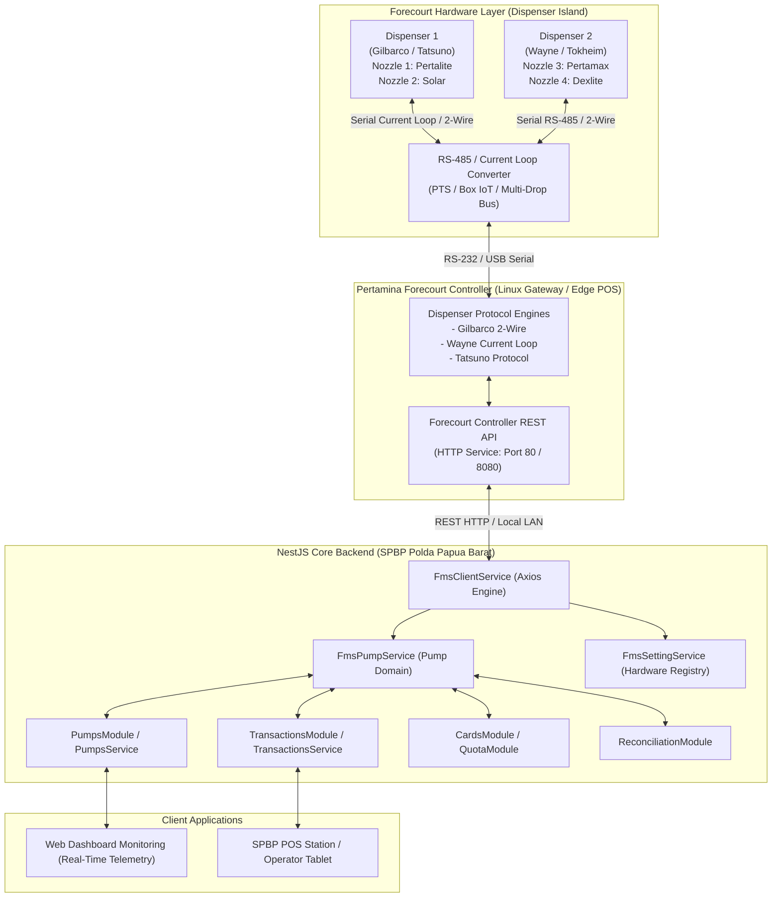
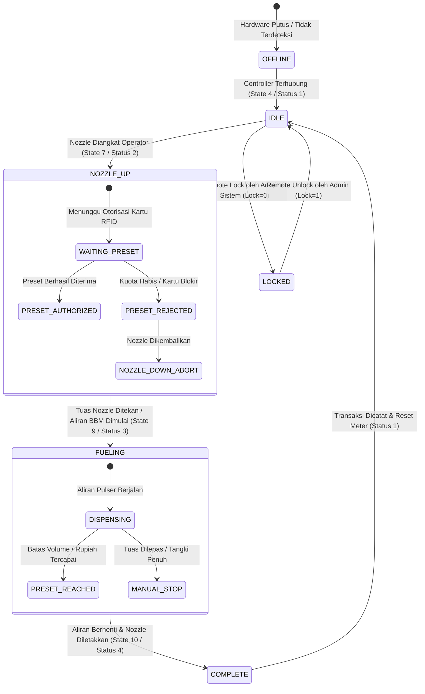
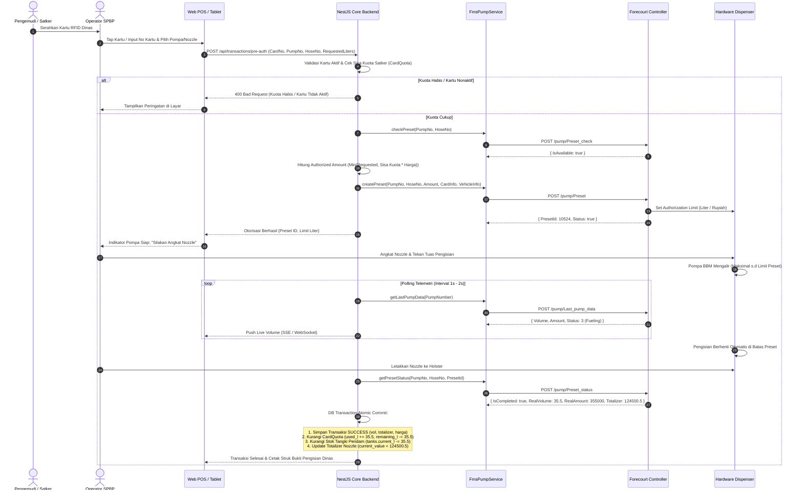

# Analisis Mendalam Integrasi FMS Module dengan Pompa & Nozzle Dispenser
## SPBP Polda Papua Barat × Pertamina Forecourt Controller & Dispenser Interface

Dokumen ini merupakan panduan arsitektur teknis dan analisis komprehensif mengenai integrasi tingkat lanjut antara **FmsModule & Services** ([`FmsPumpService`](file:///f:/project/pertamina/Dashboar%20Monitoring%20Fuel/backend/src/modules/fms/services/fms-pump.service.ts), [`FmsSettingService`](file:///f:/project/pertamina/Dashboar%20Monitoring%20Fuel/backend/src/modules/fms/services/fms-setting.service.ts)) dengan domain pompa & nozzle ([`PumpsModule`](file:///f:/project/pertamina/Dashboar%20Monitoring%20Fuel/backend/src/modules/pumps/pumps.module.ts), [`TransactionsModule`](file:///f:/project/pertamina/Dashboar%20Monitoring%20Fuel/backend/src/modules/transactions/transactions.module.ts)) di lingkungan SPBP Polda Papua Barat.

---

## 1. Executive Summary & Sasaran Integrasi

### 1.1 Masalah Operasional Eksisting (As-Is)
1. **Pencatatan Totalizer Manual**: Operator masih menginput angka totalizer nozzle manual saat pembukaan dan penutupan shift, berpotensi terjadi *human error* atau manipulasi data.
2. **Ketiadaan Kontrol Pengisian Otomatis**: Belum ada mekanisme pembatasan liter/rupiah (preset) otomatis dari kuota kartu RFID ke dispenser; penghentian pengisian masih mengandalkan operator melihat angka meteran.
3. **Risiko Over-Quota (Penyaluran Melebihi Kuota)**: Jika operator lalai, pengisian BBM dinas bisa melebihi jatah kuota bulanan Satuan Kerja (Satker) yang bersangkutan.
4. **Visibilitas Status Forecourt Terbatas**: Dashboard monitoring belum dapat menampilkan status live dispenser pompa (idle, nozzle terangkat, sedang memompa, selesai).

### 1.2 Sasaran Integrasi Pompa & Nozzle (To-Be)
Dengan menghubungkan [`FmsPumpService`](file:///f:/project/pertamina/Dashboar%20Monitoring%20Fuel/backend/src/modules/fms/services/fms-pump.service.ts) dengan [`PumpsService`](file:///f:/project/pertamina/Dashboar%20Monitoring%20Fuel/backend/src/modules/pumps/pumps.service.ts) dan [`TransactionsService`](file:///f:/project/pertamina/Dashboar%20Monitoring%20Fuel/backend/src/modules/transactions/transactions.service.ts):
- **Closed-Loop Smart Pre-Authorization**: Dispenser hanya mengalirkan BBM jika mendapat perintah preset terotorisasi berdasarkan validasi kuota kartu RFID aktif.
- **Auto-Sync Totalizer Elektronik**: Nilai totalizer nozzle dibaca langsung secara elektronik dari pulser/dispenser register setiap siklus transaksi dan pergantian shift.
- **Monitoring Live Status Nozzle**: Menampilkan status real-time nozzle dispenser pada dashboard (Idle, Nozzle Up, Fueling, Complete, Error/Offline).
- **Emergency Remote Lock/Unlock**: Kemampuan sistem/admin untuk mengunci dispenser secara remote jika terjadi anomali (misal: stok tangki kritis, kuota habis, atau pelanggaran keamanan).
- **Zero-Loss Offline Replay**: Transaksi yang terjadi saat jaringan server terganggu dapat ditarik kembali (*buffer replay*) melalui endpoint audit buffer dispenser.

---

## 2. Topologi Hardware & Protokol Komunikasi Dispenser



### Karakteristik Protokol & Hardware Dispenser:
1. **Multi-Drop Serial Communication**: Controller berkomunikasi dengan dispenser melalui bus serial (Current Loop, RS-485, atau protokol eksklusif pabrikan seperti Gilbarco Two-Wire).
2. **Controller Abstraction Layer**: Controller Forecourt Pertamina mengabstraksikan perintah hardware tingkat rendah menjadi JSON REST API standar yang diakses oleh `FmsPumpService`.
3. **Nozzle Mapping (Hose to Product & Tank)**: Setiap nozzle fisik terhubung ke satu jenis produk BBM dan satu saluran pipa tangki pendam.

---

## 3. State Machine & Siklus Hidup Dispenser & Nozzle

Dispenser pompa memiliki 2 model status: **Operational State** (level controller) dan **Pump Status** (level telemetri pengisian).



### Tabel Definisi State & Status Controller:

| Code Controller (`/pump/State`) | Code Telemetri (`/pump/Last_pump_data`) | Nama Status | Deskripsi Operasional | Aksi Sistem Backend |
|---|---|---|---|---|
| **1** | **0** | `OFFLINE` | Dispenser mati, kabel serial terputus, atau controller error. | Trigger alert koneksi ke dashboard admin. |
| **4** | **1** | `IDLE` | Nozzle terpasang di dispenser, motor pompa mati, siap menerima order. | Display status "Tersedia / Siap" di POS & Dashboard. |
| **7** | **2** | `NOZZLE_UP` | Nozzle diangkat dari dudukannya (*holster*). Dispenser menunggu otorisasi preset. | Cek preset RFID / kirim limit liter ke controller. |
| **9** | **3** | `FUELING` | Solenoid valve terbuka, motor pompa berputar, BBM mengalir ke tangki kendaraan. | Polling live volume & rupiah berjalan ke dashboard. |
| **10** | **4** | `COMPLETE` | Pengisian selesai, nozzle dikembalikan ke holster. Data transaksi final siap dibaca. | Commit transaksi, kurangi kuota kartu, update totalizer. |

---

## 4. Matriks Pemetaan Endpoint FMS vs Entity Backend

Berikut pemetaan lengkap antara API Forecourt Controller ([`FmsPumpService`](file:///f:/project/pertamina/Dashboar%20Monitoring%20Fuel/backend/src/modules/fms/services/fms-pump.service.ts) / [`FmsSettingService`](file:///f:/project/pertamina/Dashboar%20Monitoring%20Fuel/backend/src/modules/fms/services/fms-setting.service.ts)) dengan Database Entities:

### 4.1 Pemetaan Tabel Data:

| Endpoint FMS Controller | Method | Parameter Utama | Target Entity Backend | Field Entity yang Terisi / Tersinkron |
|---|---|---|---|---|
| `/pump/List_pump` | POST | `{}` | [`Pump`](file:///f:/project/pertamina/Dashboar%20Monitoring%20Fuel/backend/src/database/entities/pump.entity.ts), [`Nozzle`](file:///f:/project/pertamina/Dashboar%20Monitoring%20Fuel/backend/src/database/entities/nozzle.entity.ts), [`Product`](file:///f:/project/pertamina/Dashboar%20Monitoring%20Fuel/backend/src/database/entities/product.entity.ts) | `pumps.number`, `pumps.status`, `nozzles.number`, `nozzles.product_id`, `products.price` |
| `/pump/Last_pump_data` | POST | `PumpNumber` | [`Totalizer`](file:///f:/project/pertamina/Dashboar%20Monitoring%20Fuel/backend/src/database/entities/totalizer.entity.ts), Telemetri Cache | `totalizers.current_value`, Live Volume, Live Amount, Operational Status |
| `/pump/State` | POST | `PumpNo` | [`Pump`](file:///f:/project/pertamina/Dashboar%20Monitoring%20Fuel/backend/src/database/entities/pump.entity.ts) (Live Status) | `pumps.status` ('ACTIVE', 'OFFLINE', dll) |
| `/pump/Preset_check` | POST | `PumpNo`, `HoseNo` | Validasi Pre-Auth | Memastikan nozzle target dalam kondisi `IDLE` dan siap menerima preset |
| `/pump/Preset` | POST | `PumpNo`, `HoseNo`, `Amount`, `Card`, `VehicleNo` | [`Transaction`](file:///f:/project/pertamina/Dashboar%20Monitoring%20Fuel/backend/src/database/entities/transaction.entity.ts) (Pending) | `transactions.status = 'PENDING'`, `transactions.quota_before`, otorisasi hardware |
| `/pump/Preset_status` | POST | `PumpNo`, `HoseNo`, `PresetId` | [`Transaction`](file:///f:/project/pertamina/Dashboar%20Monitoring%20Fuel/backend/src/database/entities/transaction.entity.ts), [`CardQuota`](file:///f:/project/pertamina/Dashboar%20Monitoring%20Fuel/backend/src/database/entities/card-quota.entity.ts), [`Tank`](file:///f:/project/pertamina/Dashboar%20Monitoring%20Fuel/backend/src/database/entities/tank.entity.ts) | `transactions.volume_l`, `transactions.total_amount`, `transactions.status = 'SUCCESS'`, `card_quotas.remaining_l`, `tanks.current_l` |
| `/pump/Lock` | POST | `PumpNumber`, `Lock` (0=Lock, 1=Unlock) | [`Pump`](file:///f:/project/pertamina/Dashboar%20Monitoring%20Fuel/backend/src/database/entities/pump.entity.ts) | `pumps.status = 'INACTIVE' / 'MAINTENANCE'`, `pumps.active = 0/1` |
| `/pump/Change_mop` | POST | `DeliveryId`, `VehicleNo`, `AgencyName`, `Payments` | [`Transaction`](file:///f:/project/pertamina/Dashboar%20Monitoring%20Fuel/backend/src/database/entities/transaction.entity.ts) | Metadata Satker, Nopol kendaraan, metode pembayaran |
| `/pump/Last_post_purchase` | POST | `PumpNo`, `Row` | [`Transaction`](file:///f:/project/pertamina/Dashboar%20Monitoring%20Fuel/backend/src/database/entities/transaction.entity.ts) (Buffer Recovery) | Replay transaksi offline yang belum tersimpan di DB |
| `/setting/Get_pumps_config` | GET | - | [`Pump`](file:///f:/project/pertamina/Dashboar%20Monitoring%20Fuel/backend/src/database/entities/pump.entity.ts), [`Nozzle`](file:///f:/project/pertamina/Dashboar%20Monitoring%20Fuel/backend/src/database/entities/nozzle.entity.ts) | Discovery konfigurasi port COM, dispenser ID, nozzle channel, tank link |

---

## 5. Skenario Integrasi Utama (End-to-End Scenarios)

### Skenario 1: Smart Pre-Authorization Pengisian BBM Berbasis Kuota RFID
Skenario saat kendaraan dinas datang ke pulau pompa SPBP:



---

### Skenario 2: Sinkronisasi Totalizer Elektronik & Pergantian Shift

Totalizer dispenser merupakan tolok ukur utama audit forecourt. Setiap liter yang keluar dari pulser nozzle dicatat dalam penghitung kumulatif (tidak bisa di-reset).

```mermaid
flowchart TD
    StartShift["1. Buka Shift Operator (PAGI / SIANG / MALAM)"] --> ReadOpenTotalizer["2. Polling Totalizer Pembukaan dari FMS\n(fms.pumps.getLastPumpData)"]
    ReadOpenTotalizer --> SaveOpenDB["3. Simpan ke tabel totalizers\n(opening_value = TotalizerController)"]
    
    SaveOpenDB --> OperationalPeriod["4. Periode Operasional Shift Berjalan\n(Transaksi BBM Dinas & Emergency)"]
    
    OperationalPeriod --> CloseShiftTrigger["5. Tutup Shift Operator"]
    CloseShiftTrigger --> ReadCloseTotalizer["6. Polling Totalizer Penutupan dari FMS\n(fms.pumps.getLastPumpData)"]
    ReadCloseTotalizer --> CalcDispensed["7. Hitung Pengeluaran Fisik:\nActual_Dispensed = Closing_Value - Opening_Value"]
    
    CalcDispensed --> QuerySysSales["8. Query Total Penjualan Sistem:\nSystem_Sales = SUM(transactions.volume_l) WHERE shift = current"]
    
    QuerySysSales --> CalcVariance["9. Hitung Selisih (Variance):\nVariance = Actual_Dispensed - System_Sales"]
    
    CalcVariance --> EvalVariance{Variance == 0?}
    EvalVariance -->|Ya (0 Liter)| ReconPass["10. Rekonsiliasi Sempurna (Match) -> Tutup Shift Sukses"]
    EvalVariance -->|Tidak (Selisih > 0 / < 0)| ReconFlag["11. Rekonsiliasi Anomali -> Catat Log Audit & Flag Discrepancy"]
```

---

### Skenario 3: Emergency Remote Lock & Interlock Keamanan

Jika terdeteksi insiden atau kondisi abnormal, sistem backend dapat langsung memutus suplai daya/aliran pompa melalui API `/pump/Lock`:

1. **Pemicu Otomatis (System Interlocks)**:
   - **Level Tangki Rendah (*Low Level Alarm*)**: Sensor ATG mendeteksi volume tangki di bawah batas aman sedot (*dead stock limit*), otomatis Lock semua pompa yang terhubung ke tangki tersebut untuk mencegah kerusakan pompa submersible.
   - **Intrusi Air (*High Water Alarm*)**: Sensor ATG mendeteksi air di dasar tangki melebihi batas toleransi (> 2 cm), otomatis Lock pompa untuk mencegah BBM tercampur air masuk ke kendaraan dinas.
   - **Anomali Selisih Kuota Ekstrem**: Jika terdeteksi transaksi mencurigakan berulang dalam hitungan menit.
2. **Pemicu Manual (Operator / Super Admin)**:
   - Tombol *Emergency Stop* pada Dashboard Monitoring untuk mematikan pulau pompa tertentu saat kebakaran/kebocoran pipa.

```typescript
// Blueprint Penguncian Darurat Dispenser
async function emergencyLockPump(fms: FmsService, pumpNumber: number, reason: string) {
  // 1. Kirim sinyal Lock ke Forecourt Controller
  const result = await fms.pumps.lockPump({
    PumpNumber: pumpNumber,
    Lock: 0, // 0 = Lock / Putus Aliran
  });

  // 2. Catat insiden ke Audit Log
  await auditService.log({
    action: 'EMERGENCY_PUMP_LOCK',
    target: `Pump-${pumpNumber}`,
    details: { reason, result },
  });

  return result;
}
```

---

### Skenario 4: Penanganan Under-Fueling (Pengisian Berhenti Lebih Awal)

Kondisi umum di lapangan:
- Pengemudi meminta preset 50 Liter (senilai sisa kuotanya).
- Namun tangki kendaraan dinas ternyata sudah penuh di angka **38.2 Liter**, sehingga nozzle otomatis *klik* (cut-off) dan operator mengembalikan nozzle ke holster.

**Mekanisme Penanganan Kuota (Reservation vs Final Deduction)**:
1. Saat Pre-Auth (`/pump/Preset`), kuota tidak langsung dipotong permanen, melainkan di-*reserve* / di-hold.
2. Saat pengisian selesai (`/pump/Preset_status`), nilai volume riil yang dikembalikan adalah **38.2 Liter**.
3. Backend melakukan pemotongan kuota berdasarkan **volume riil 38.2 Liter**, bukan 50 Liter yang di-preset:
   $$\text{Quota Deducted} = 38.2 \text{ L}$$
   $$\text{Quota Remaining} = \text{Quota Before} - 38.2 \text{ L}$$
4. Sisa kuota 11.8 Liter tetap utuh pada akun kartu Satker.

---

## 6. Blueprint Implementasi Integrasi (TypeScript / NestJS)

Berikut adalah blueprint service terpadu [`ForecourtPumpManagerService`](file:///f:/project/pertamina/Dashboar%20Monitoring%20Fuel/backend/src/modules/pumps/forecourt-pump-manager.service.ts) yang mengorkestrasikan komunikasi antara `PumpsModule`, `FmsPumpService`, dan `TransactionsService`:

```typescript
import { Injectable, Logger, BadRequestException, NotFoundException } from '@nestjs/common';
import { InjectRepository } from '@nestjs/typeorm';
import { Repository, DataSource } from 'typeorm';
import {
  Pump,
  Nozzle,
  Totalizer,
  Transaction,
  Card,
  CardQuota,
  Tank,
  Product,
} from '../../database/entities';
import { FmsService } from '../fms';
import { toNum } from '../../common/utils/db.util';
import { v4 as uuid } from 'uuid';

export interface PreAuthRequestDto {
  cardNumber: string;
  pumpNumber: number;
  nozzleNumber: number;
  requestedVolumeL?: number;
  operatorId: string;
  shift: 'PAGI' | 'SIANG' | 'MALAM';
}

@Injectable()
export class ForecourtPumpManagerService {
  private readonly logger = new Logger(ForecourtPumpManagerService.name);

  constructor(
    @InjectRepository(Pump)
    private readonly pumpRepo: Repository<Pump>,
    @InjectRepository(Nozzle)
    private readonly nozzleRepo: Repository<Nozzle>,
    @InjectRepository(Totalizer)
    private readonly totalizerRepo: Repository<Totalizer>,
    @InjectRepository(Transaction)
    private readonly txRepo: Repository<Transaction>,
    @InjectRepository(Card)
    private readonly cardRepo: Repository<Card>,
    @InjectRepository(CardQuota)
    private readonly quotaRepo: Repository<CardQuota>,
    @InjectRepository(Tank)
    private readonly tankRepo: Repository<Tank>,
    private readonly dataSource: DataSource,
    private readonly fms: FmsService,
  ) {}

  /**
   * 1. Smart Pre-Authorization Dispenser berdasarkan Kuota RFID Aktif
   */
  async preAuthorizeDispenser(dto: PreAuthRequestDto) {
    // A. Validasi status kartu dinas & relasi kendaraan/satker
    const card = await this.cardRepo.findOne({
      where: { cardNumber: dto.cardNumber },
      relations: ['vehicle', 'unit'],
    });

    if (!card || card.status !== 'ACTIVE') {
      throw new BadRequestException('Kartu RFID tidak terdaftar atau dalam status blokir/inaktif');
    }

    // B. Cari Nozzle & Produk terkait
    const pump = await this.pumpRepo.findOne({ where: { number: String(dto.pumpNumber) } });
    if (!pump) throw new NotFoundException(`Pompa ${dto.pumpNumber} tidak ditemukan`);

    const nozzle = await this.nozzleRepo.findOne({
      where: { pumpId: pump.id, number: String(dto.nozzleNumber) },
      relations: ['product'],
    });
    if (!nozzle) throw new NotFoundException(`Nozzle ${dto.nozzleNumber} pada Pompa ${dto.pumpNumber} tidak ditemukan`);

    // C. Cek Sisa Kuota Satker pada Periode Aktif
    const quota = await this.quotaRepo
      .createQueryBuilder('cq')
      .innerJoin('cq.period', 'qp')
      .where('cq.cardId = :cardId AND cq.productId = :productId AND qp.status = :status', {
        cardId: card.id,
        productId: nozzle.productId,
        status: 'ACTIVE',
      })
      .getOne();

    const remainingQuotaL = toNum(quota?.remainingL, 0);
    if (remainingQuotaL <= 0) {
      throw new BadRequestException(`Sisa kuota BBM (${nozzle.product.name}) untuk kartu ini sudah habis (0 Liter)`);
    }

    // D. Cek ketersediaan hardware dispenser via FmsPumpService
    const checkRes = await this.fms.pumps.checkPreset({
      PumpNo: dto.pumpNumber,
      HoseNo: dto.nozzleNumber,
    });

    if (checkRes.IsAvailable === false) {
      throw new BadRequestException(`Dispenser Pompa ${dto.pumpNumber} Hose ${dto.nozzleNumber} sedang sibuk atau offline`);
    }

    // E. Hitung batas volume & rupiah (Limit Preset)
    const activePrice = 10000; // Dapat diambil dari priceHistoryRepo
    const maxVolumeAllowed = dto.requestedVolumeL
      ? Math.min(dto.requestedVolumeL, remainingQuotaL)
      : remainingQuotaL;
    const presetAmountRupiah = maxVolumeAllowed * activePrice;

    // F. Kirim perintah Preset ke Forecourt Controller Hardware
    const presetRes = await this.fms.pumps.createPreset({
      PumpNo: dto.pumpNumber,
      HoseNo: dto.nozzleNumber,
      Amount: presetAmountRupiah,
      VehicleNo: card.vehicle?.policeNumber ?? '',
      VehicleType: card.vehicle?.brand ?? '',
      AgencyName: card.unit?.name ?? 'Polda Papua Barat',
      CustomerType: 'DINAS_POLRI',
      Card: {
        CardNo: card.cardNumber,
        PlateNo: card.vehicle?.policeNumber,
        CustomerName: card.holderName,
        Balance: remainingQuotaL,
      },
    });

    this.logger.log(`Preset berhasil dibuat di Pompa ${dto.pumpNumber} PresetId=${presetRes.PresetId} MaxVol=${maxVolumeAllowed}L`);

    return {
      success: true,
      presetId: presetRes.PresetId,
      pumpNumber: dto.pumpNumber,
      nozzleNumber: dto.nozzleNumber,
      productName: nozzle.product.name,
      authorizedVolumeL: maxVolumeAllowed,
      authorizedAmount: presetAmountRupiah,
      remainingQuotaBeforeL: remainingQuotaL,
      message: 'Dispenser terotorisasi. Silakan angkat nozzle untuk pengisian BBM dinas.',
    };
  }

  /**
   * 2. Finalisasi Transaksi Setelah Nozzle Selesai Mengisi (Polling Handler)
   */
  async finalizeFuelingTransaction(params: {
    pumpNumber: number;
    nozzleNumber: number;
    presetId: number;
    cardId: string;
    operatorId: string;
    shift: 'PAGI' | 'SIANG' | 'MALAM';
  }) {
    // A. Ambil data status final dari Forecourt Controller
    const statusRes = await this.fms.pumps.getPresetStatus({
      PumpNo: params.pumpNumber,
      HoseNo: params.nozzleNumber,
      PresetId: params.presetId,
    });

    // Validasi apakah transaksi dispenser sudah tuntas (IsCompleted)
    const isCompleted = statusRes.IsCompleted ?? true;
    const realVolume = toNum(statusRes.RealVolume ?? statusRes.Volume ?? 0);
    const realAmount = toNum(statusRes.RealAmount ?? statusRes.Amount ?? 0);
    const unitPrice = realVolume > 0 ? Math.round(realAmount / realVolume) : 10000;
    const endTotalizer = toNum(statusRes.Totalizer);

    if (!isCompleted || realVolume <= 0) {
      return { completed: false, message: 'Pengisian masih berlangsung atau belum ada liter keluar.' };
    }

    // B. Cari data pendukung
    const card = await this.cardRepo.findOne({ where: { id: params.cardId }, relations: ['unit', 'vehicle'] });
    const pump = await this.pumpRepo.findOne({ where: { number: String(params.pumpNumber) } });
    const nozzle = await this.nozzleRepo.findOne({
      where: { pumpId: pump?.id, number: String(params.nozzleNumber) },
      relations: ['product'],
    });

    const quota = await this.quotaRepo
      .createQueryBuilder('cq')
      .innerJoin('cq.period', 'qp')
      .where('cq.cardId = :cardId AND cq.productId = :productId AND qp.status = :status', {
        cardId: params.cardId,
        productId: nozzle?.productId,
        status: 'ACTIVE',
      })
      .getOne();

    const quotaBefore = toNum(quota?.remainingL, 0);
    const quotaDeducted = Math.min(realVolume, quotaBefore);
    const quotaAfter = Math.max(0, quotaBefore - quotaDeducted);

    const txId = uuid();

    // C. Atomic Database Commit (Transaction + Quota + Tank + Totalizer)
    await this.dataSource.transaction(async (em) => {
      // 1. Buat record transaksi
      const tx = em.create(Transaction, {
        id: txId,
        cardId: card?.id,
        productId: nozzle?.productId,
        nozzleId: nozzle?.id,
        pumpId: pump?.id,
        operatorId: params.operatorId,
        shift: params.shift,
        volumeL: realVolume,
        pricePerUnit: unitPrice,
        totalAmount: realAmount,
        totalizerAfter: endTotalizer > 0 ? endTotalizer : undefined,
        quotaBefore,
        quotaDeducted,
        quotaAfter,
        status: 'SUCCESS',
        source: 'CONTROLLER',
        transactionTime: new Date(),
      });
      await em.save(Transaction, tx);

      // 2. Potong jatah kuota satker
      if (quota) {
        await em
          .createQueryBuilder()
          .update(CardQuota)
          .set({
            usedL: () => `used_l + ${quotaDeducted}`,
            remainingL: () => `remaining_l - ${quotaDeducted}`,
          })
          .where('id = :id', { id: quota.id })
          .execute();
      }

      // 3. Potong stok tangki pendam
      await em
        .createQueryBuilder()
        .update(Tank)
        .set({
          currentL: () => `GREATEST(0, current_l - ${realVolume})`,
        })
        .where('productId = :productId', { productId: nozzle?.productId })
        .execute();

      // 4. Update totalizer nozzle terkini
      if (nozzle && endTotalizer > 0) {
        await em
          .createQueryBuilder()
          .update(Totalizer)
          .set({ currentValue: endTotalizer })
          .where('nozzleId = :nozzleId AND shift = :shift', {
            nozzleId: nozzle.id,
            shift: params.shift,
          })
          .execute();
      }
    });

    this.logger.log(`Finalisasi transaksi sukses: TxId=${txId} Vol=${realVolume}L Totalizer=${endTotalizer}`);

    return {
      completed: true,
      transactionId: txId,
      volumeDispensedL: realVolume,
      totalAmount: realAmount,
      quotaRemainingL: quotaAfter,
      totalizer: endTotalizer,
    };
  }

  /**
   * 3. Sync Totalizer Otomatis dari Controller untuk Seluruh Nozzle
   */
  async syncElectronicTotalizers(shift: 'PAGI' | 'SIANG' | 'MALAM', shiftDate?: string) {
    const targetDate = shiftDate ?? new Date().toISOString().slice(0, 10);
    const pumps = await this.pumpRepo.find({ relations: ['nozzles'] });
    const syncResults = [];

    for (const p of pumps) {
      try {
        const lastData = await this.fms.pumps.getLastPumpData({ PumpNumber: Number(p.number) });

        if (lastData && lastData.Totalizer) {
          const currentTotalizer = Number(lastData.Totalizer);
          const targetHose = lastData.HoseNo ?? 1;

          const nozzle = p.nozzles?.find((n) => Number(n.number) === targetHose) ?? p.nozzles?.[0];

          if (nozzle) {
            const existing = await this.totalizerRepo.findOne({
              where: { nozzleId: nozzle.id, shiftDate: targetDate, shift },
            });

            if (existing) {
              await this.totalizerRepo.update(existing.id, {
                currentValue: currentTotalizer,
              });
              syncResults.push({ nozzleId: nozzle.id, pumpNumber: p.number, updated: true, totalizer: currentTotalizer });
            } else {
              const newTot = this.totalizerRepo.create({
                id: uuid(),
                nozzleId: nozzle.id,
                openingValue: currentTotalizer,
                currentValue: currentTotalizer,
                shiftDate: targetDate,
                shift,
              });
              await this.totalizerRepo.save(newTot);
              syncResults.push({ nozzleId: nozzle.id, pumpNumber: p.number, created: true, totalizer: currentTotalizer });
            }
          }
        }
      } catch (err: any) {
        this.logger.warn(`Gagal membaca totalizer Pompa ${p.number}: ${err.message}`);
      }
    }

    return syncResults;
  }
}
```

---

## 7. Penanganan Kasus Khusus & Kegagalan (Edge Cases & Resilience)

| Skenario Kasus | Resiko / Gejala | Mitigasi Teknis & Solusi Teruji |
|---|---|---|
| **Nozzle Up Timeout** | Operator mengangkat nozzle tetapi tidak melakukan pengisian selama > 60 detik. | Controller otomatis membatalkan (*abort*) preset. Backend mendeteksi status `IDLE` kembali tanpa memotong kuota kartu. |
| **Koneksi Controller Terputus Saat Fueling** | Jaringan LAN SPBU putus saat BBM sedang mengalir. | Dispenser tetap menyelesaikan pengisian sesuai limit preset lokal. Saat koneksi pulih, backend memanggil `/pump/Last_post_purchase` untuk menarik data transaksi yang tertunda (*buffer replay*). |
| **Penyaluran Tidak Sah / Bypass Manual** | Pengisian dilakukan menggunakan switch manual tanpa melewati otorisasi sistem. | Deteksi varians: Totalizer elektronik bertambah namun tidak ada transaksi sukses di sistem. Sistem otomatis membunyikan alarm selisih (*variance alert*) pada menu Rekonsiliasi. |
| **Solenoid Valve Leaking (Tetesan)** | Pompa mengalami kebocoran mikro yang menambah putaran pulser tanpa pengisian sah. | Kalibrasi toleransi varians harian (< 0.5% batas standar metrologi legal Pertamina). |
| **Konflik Multi-Nozzle pada 1 Pompa** | Dua nozzle pada pompa yang sama diangkat bersamaan. | Controller hanya mengizinkan 1 nozzle aktif per saluran hidrolik dispenser (interlock hardware). Endpoint `/pump/Preset_check` akan menolak otorisasi nozzle kedua. |

---

## 8. Usulan Roadmap Integrasi API Modul Pompa & Nozzle

Untuk memaksimalkan penggunaan controller forecourt, direkomendasikan penambahan endpoint berikut pada [`PumpsController`](file:///f:/project/pertamina/Dashboar%20Monitoring%20Fuel/backend/src/modules/pumps/pumps.controller.ts):

```
[GET]    /api/pumps/live-status          -> Monitoring status real-time seluruh pompa (Idle, Fueling, Nozzle Up, Offline)
[POST]   /api/pumps/pre-auth             -> Smart Pre-Authorization pengisian dinas (Validasi RFID + Set Preset)
[POST]   /api/pumps/lock                 -> Remote Lock / Unlock dispenser pompa (Security & Emergency Stop)
[POST]   /api/pumps/sync-totalizers      -> Tarik totalizer elektronik real-time dari controller ke database
[GET]    /api/pumps/offline-buffer       -> Audit & replay transaksi offline yang belum tersimpan di backend
```

---

## 9. Kesimpulan & Rekomendasi Tindak Lanjut

1. **Efisiensi & Anti-Fraud**: Integrasi FMS dengan Pompa dan Nozzle menghapus 100% potensi kesalahan catat manual dan manipulasi pengisian BBM dinas di SPBP Polda Papua Barat.
2. **Kesiapan Modul**: Fondasi [`FmsPumpService`](file:///f:/project/pertamina/Dashboar%20Monitoring%20Fuel/backend/src/modules/fms/services/fms-pump.service.ts) dan DTO yang telah dibangun sudah mencakup seluruh kebutuhan operasional forecourt (List, Last Data, State, Preset, Preset Check/Status, Lock, Change MOP, Last Purchases).
3. **Langkah Implementasi Bertahap**:
   - **Tahap A (Monitoring)**: Aktifkan auto-sync totalizer elektronik dan status live pompa.
   - **Tahap B (Otorisasi)**: Implementasikan pre-auth RFID preset untuk pengisian armada kendaraan dinas Polri.
   - **Tahap C (Automated Recon)**: Hubungkan rekonsiliasi 3 arah harian tanpa intervensi manual.
